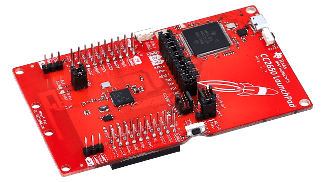
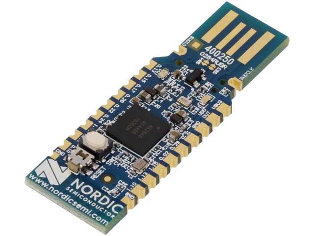
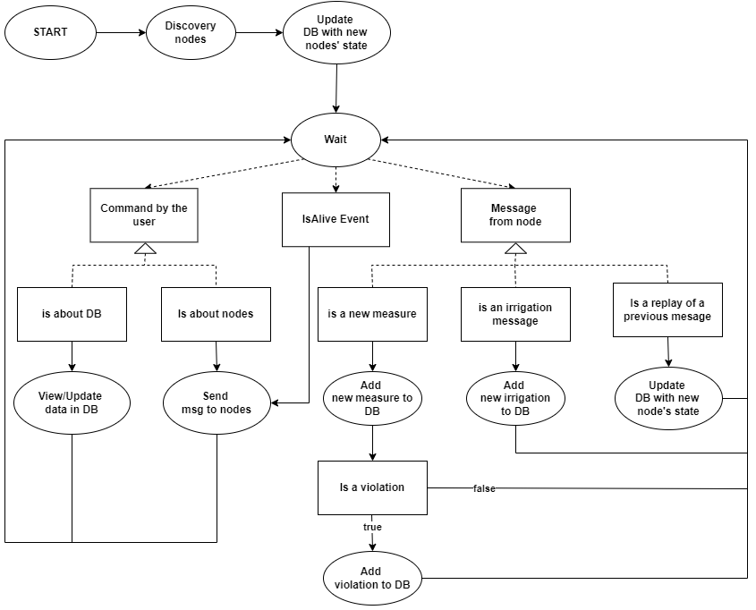
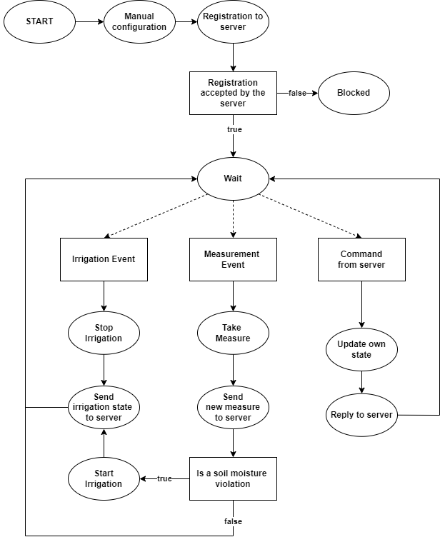
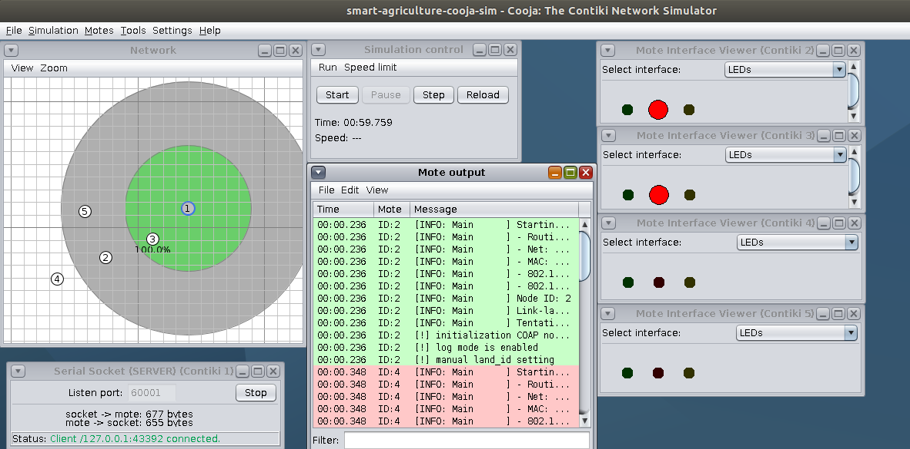
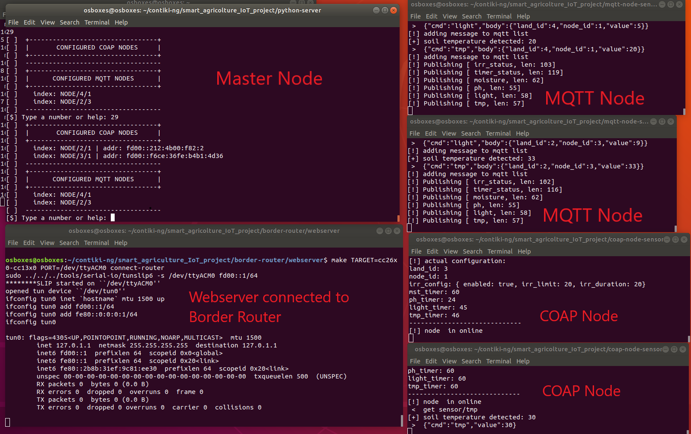
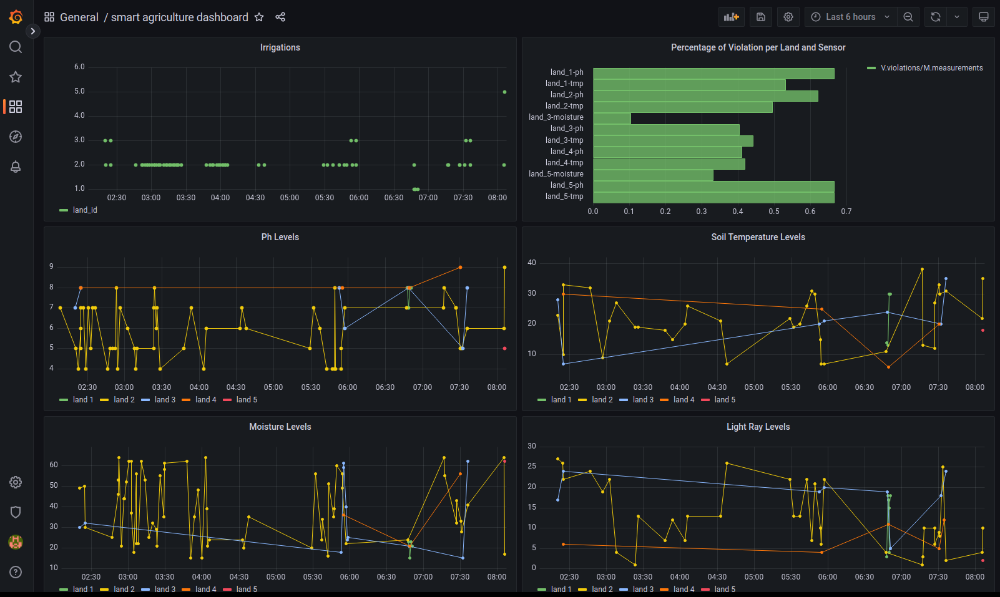
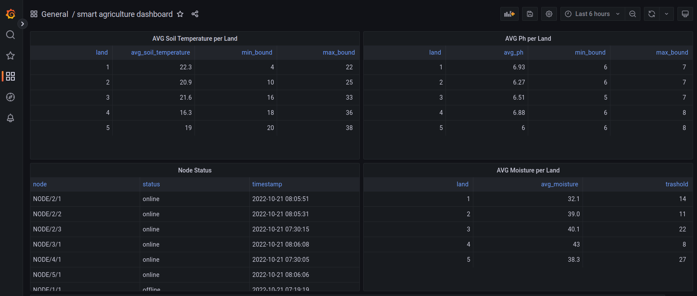
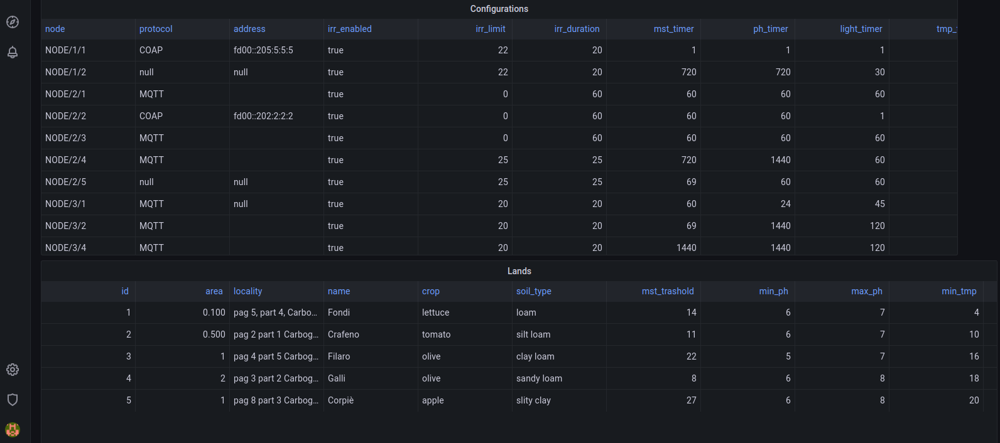

# Smart Agriculture IoT project

The project is about smart agriculture and is a system that allows to monitor
the status of their cultivated areas by automatically managing irrigation.
The network consists of a border router, an undefined number of scattered nodes throughout the lands and a central server (the Master) that coordinates and manages all nodes.
From the project specifications half of the nodes must use the COAP protocol and half
the MQTT protocol, so the Master is able to communicate using both protocols.

The project is designed to fit an undefined number of lands and an undefined extension
for each one, for this reason any area can be monitored by one or more nodes of the
network. Each node must be identified with two identifiers, one relative to the land
(land id) and one related to nodes on the same land (node id).

Each land differs from the other for the following parameters:
* id
* area (in acres)
* locality (in legal name)
* name (common name)
* crop
* soil type (Sand, Loam, Silt, Clay, Loamy Sand ...)

Within every land are nodes that measures the following values:
* soil moisture (in percentage)
* ph level (values from 0 to 14)
* light ray level (in DLI - Daily Light Integral)
* soil temperature (in Celsius)

In addition, a land, depending on its characteristics, has limits for each type of value.
When a measure exceeds its limit, a violation is generated so that the problem can be
resolved before the crop is damaged.
For the light ray are no bounds because every day, depending on the hour, the measurements vary drastically.
In case of soil moisture violation, the system acts autonomously by starting an irrigation operation in the area.

## Technogies used
### Software

* Contiki-ng 
* Mysql
* Paho
* Coapthon

### Hardware
* General parpose machine
* CC2650 Launchpad board

  

* bRF52840 dongle board

  

To test the project it was used docker

## Components

* Python server
* MQTT node
* COAP node
* border router node
* MQTT broker (mosquitto)

## Use Case
The user can interact with the terminal interface of the central server (master) to check
the network status, modify data on the database and send messages to nodes. These are
all operations that it’s possible to do.
* Type ’help’ to see all commands
* Type ’exit’ to close the master
* See all lands data and configurations data
* See all measurements, violations and irrigations made in the past
* Change configuration of a node
* Ask a node its configuration
* Ask a node to do a measurement
* Check if a node is online
* Add new land, configuration, measurement, irrigation
* Update an existing land and configuration
* Set online a node
* Set offline all nodes
* Delete a land, configuration, measurement, violation and irrigation
* Do a test about the message reception
* See all registered nodes at that moment

## Data Diagram

  

## The Master State Machine

  

## The Node State Machine

  

## Test On Cooja

1. enter in the contiki docker's container in witch is the project folder
	* > sudo docker ps -i
	* > sudo docker start [id contiki] (if not already started)
	* > sudo docker exec -it [id contiki] bash
	* > cd tools/cooja
	* > ant run

2. start mqtt broker by the terminal of your machine (not in container)
	* > mosquitto -v

3. start cooja simulation by opening the simulation "smart_agricolture_cooja_sim.csc"

4. open a new terminal in your machine
	* go to project folder
	* > cd border-router/web-server
	* > make TARGET=cooja connect-router-cooja

5. open a new terminal in your machine
	* go to project folder
	* > cd python-server
	* > python3 server.py

6. configure nodes by clicking on button in their menu (right click)

7. use server, enter "help" to see command, view server log

  

## Test On Real Nodes

0. flash all nodes
* for each node connected to the pc i have to know the port tty
* cd /dev
* ls
* cat ttyACM0 (see serial optuput)
* try all ttyACM?, the correct one is that respond you from serial
* remember that in the commands to flash and get output you have to replace "ttyACMX" with the correct port and you have to assign different NODE-ID for each node.

1. How to flash and get otput of launchpad
* flash: "make TARGET=cc26x0-cc13x0 BOARD=/launchpad/cc2650 PORT=/dev/ttyACMx NODEID=0x0001 source-code-name.upload"
* get output: "make TARGET=cc26x0-cc13x0 BOARD=/launchpad/cc2650 PORT=/dev/ttyACMx login"

2. How to flash and get output of dongle
* flash: "make TARGET=nrf52840 BOARD=dongle PORT=/dev/ttyACMx NODEID=0x0001 source-code-name.dfu-upload"
* get output: "make TARGET=nrf52840 BOARD=dongle PORT=/dev/ttyACMx login"

3. command to start the border-router server on linux machine "make TARGET=cc26x0-cc13x0 PORT=/dev/ttyACM0 connect-router" (in this case the border-router was flashed in a launcher)	

  

### Example commands to flash 2 launchers and 3 dongles:
* > make TARGET=cc26x0-cc13x0 BOARD=/launchpad/cc2650 PORT=/dev/ttyACM0 NODEID=0x0001 border-router.upload
* > make TARGET=cc26x0-cc13x0 BOARD=/launchpad/cc2650 PORT=/dev/ttyACM2 NODEID=0x0002 coap-node.upload 
* > make TARGET=nrf52840 BOARD=dongle PORT=/dev/ttyACM4 NODEID=0x0003 coap-node.dfu-upload
* > make TARGET=nrf52840 BOARD=dongle PORT=/dev/ttyACM5 NODEID=0x0004 mqtt-node.dfu-upload
* > make TARGET=nrf52840 BOARD=dongle PORT=/dev/ttyACM6 NODEID=0x0005 mqtt-node.dfu-upload

### Example command to get output of 2 launchers and 3 dongles:
* > make TARGET=cc26x0-cc13x0 BOARD=/launchpad/cc2650 PORT=/dev/ttyACM0 login
* > make TARGET=cc26x0-cc13x0 BOARD=/launchpad/cc2650 PORT=/dev/ttyACM2 login
* > make TARGET=nrf52840 BOARD=dongle PORT=/dev/ttyACM4 login
* > make TARGET=nrf52840 BOARD=dongle PORT=/dev/ttyACM5 login
* > make TARGET=nrf52840 BOARD=dongle PORT=/dev/ttyACM6 login

## Grafana Dashboard

  

  

  

## Author
* Gianluca Gemini (gianlucagemini98@gmail.com)